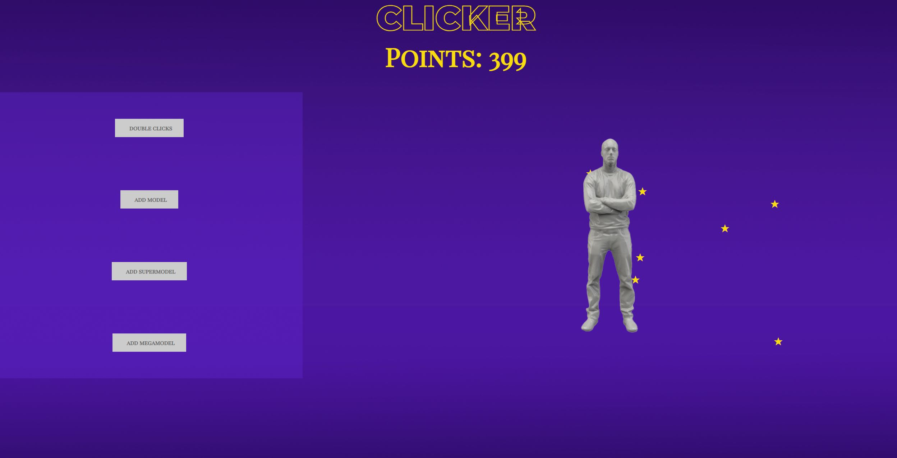

# ClickerGame
A small Clicker Game. The Goal is to achieve as many points (stars) as you can. There are certain jokers you can buy in the shop-area.
- Double Click: It doubles the amount of points you get if you click on the model.
- add Model: It sets an interval of 1 points / second.
- add SuperModel: It sets an interval of 2 points / second.
- add MegaModel: It sets an interval of 5 points / second.

How many points does your model achieve?

## Technologies
- HTML5
- CSS
- JavaScript

## IDE
- Visual Studio Code